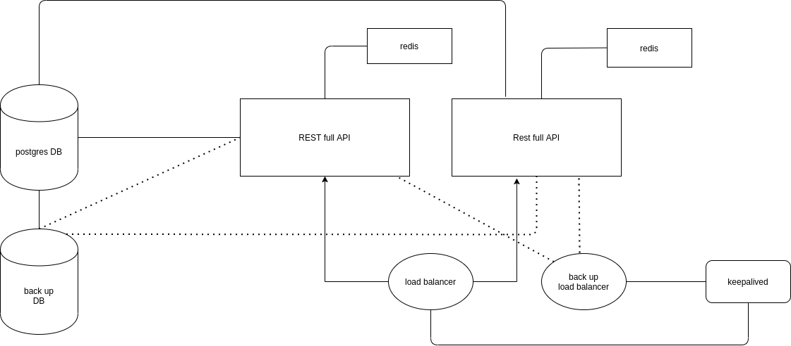
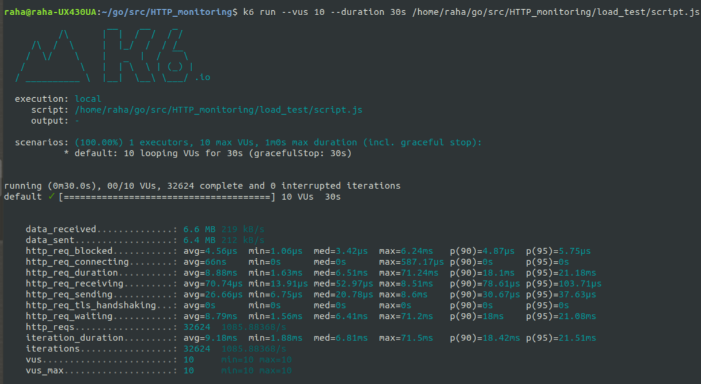

[](https://cloud.drone.io/elahe-dastan/HTTP_monitoring)
[](https://coveralls.io/github/elahe-dastan/HTTP_monitoring?branch=master)

# HTTP endpoints monitoring service
It's a service with Golang programming language to monitor HTTP endpoints so that in some configurable periods<br/>
(e.g., the 30s, 1m, 5m) this service sends HTTP requests to the endpoint and logs the response status code<br/>

## Endpoints
To use this service a user should first register at register endpoint then he should login to get a token at login<br/>
endpoint then he can use the token to add url at url endpoint 

## Database
I have used postgres database for this project 

## Example of use
```sh
$ curl -X POST -d '{"Email": "elahe.dstn@gmail.com", "Password": "XXXX"}' 
-H 'Content-Type: application/json' 127.0.0.1:8080/register
```
```sh
$ curl -X POST -d '{"Email": "elahe.dstn@gmail.com", "Password": "XXXX"}' 
-H 'Content-Type: application/json' 127.0.0.1:8080/login
```
this should return a token

```sh
$ curl -X POST -d '{"URL": "https://www.google.com", "Period": 2}' 
-H 'Content-Type: application/json' -H 'Authorization: token' 127.0.0.1:8080/url
```

## Handling URL Gets
A period of time is defined for each url to be checked.A goroutine is running and every minute it checks if each URL<br/>
should be gotten or not.The maximum Period is 100 minutes.

## Explanation of the project
I have a table for users in my postgres database when a user registers at register endpoint I save the user's info in<br/>
the table then a user which has registered before can login and I use JWT to give him a token, he can use the token to <br/>
add urls at the url endpoint the default period is 1 minute and he can specify the period explicitly when posting the<br/>
url.A goroutine is running and each minute gets all the urls, if the period has expired it gets the url and insert the<br/>
information in redis, each 100 minutes all the data in the redis will be inserted in the status table in the postgres <br/>
database and deleted from redis, these statuses will be deleted from database after 2 days.

## System design



As shown in the image I tried not to have a single point of failure so I have a backup database and I have run two<br/> 
instances of the project, there are even two load balancers and the keepalived gives the IP of the working balancer to<br/> 
another in case the first one fails to operate.

## Load test
I used K6 and here is the result:<br/>
Load test on register end point<br/>
